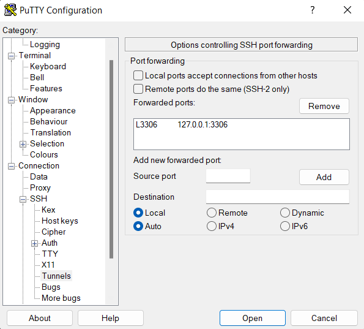
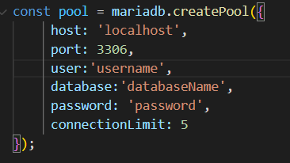

# Wigeon Databases Project Setup

## Clone the Repository

To setup this project first clone the git project git hub repository to your local machine.

> `git clone https://github.com/alexmaybar/wigeonDB.git `

## NPM Install

Once you have cloned the repository to your local machine, open `cmd` or your favorite temrminal application and navigate to the project directory.

> `cd .\wigeonDB\`

Then you will need to download all of the requirements for the mariadb connection server in the main directory.

> `npm install`

Similarily, you will need to download the npm requrements for the widgeonClient. In your `cmd` navigate to `.\widgeonClient\` and download all the requirements in the Client directory.

> `cd .\widgeonClient\`
>
> `npm install`

ANGULAR CLI HERE

## SSH Tunnel

Next, to access MariaDB you need to open a weibie2 connection in `cmd` to the port 3306

> `ssh username@shell.mathcs.bethel.edu -L3306:localhost:3306`

Then using PuTTY, create a Tunnel on port 3306 and open the Tunnel.

## MariaDB Connector

Next, in the main project directory, open the server.js file in your favorite editor. Here you will need to change the information in the pool.

In this section you will need to update these fields to match your credentials.

> `user:`
>
> `database:`
>
> `password:`

## Startup Sequence

Now, once you have opened the tunnel on port 3306 and have an open wiebie2 terminal and have updated your credentials in the `server.js` file you can start the frontend application

### 1. NPM start

Open a new window of your favorite `cmd` application and navigate to the base directory of the project. Then run this command:

> `npm start`

This will run the API on port 3000 that our frontend uses to communicate with MariaDB

### 2. NG Serve

Again, open a new window of your favorite `cmd` application and navigate to the `./widgeonClient` folder in the project. The run this command:

> `ng serve`

This will run our frontend Angular application on port 4200.

## You're in!

If you have made it this far, you have completed the setup for the WidgeonDB project. To access the application, in the browser of your choice, open

> http://localhost:4200/

You did it! Welcome to WidgeonDB!
